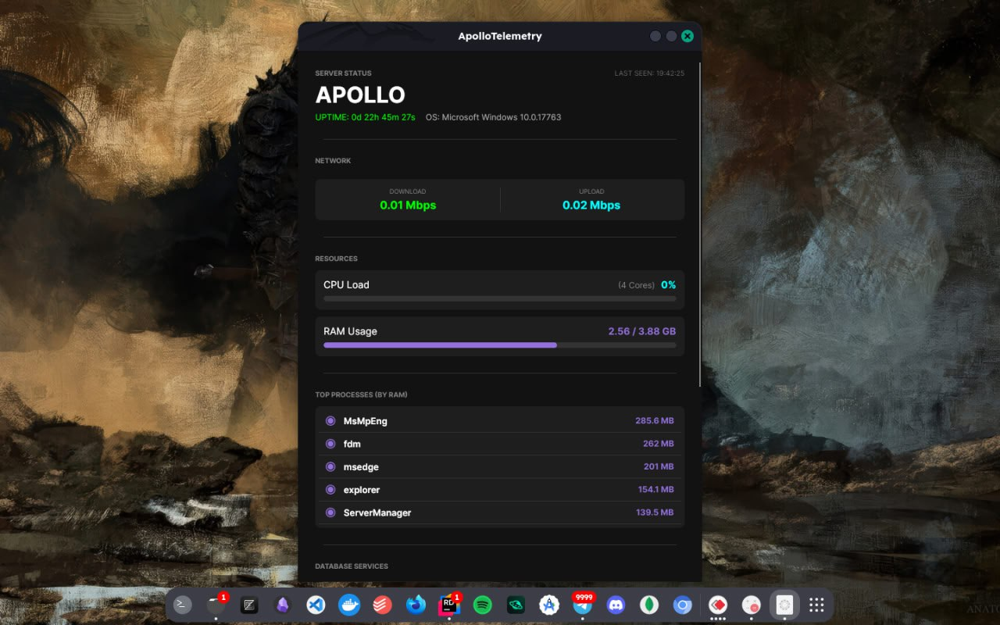
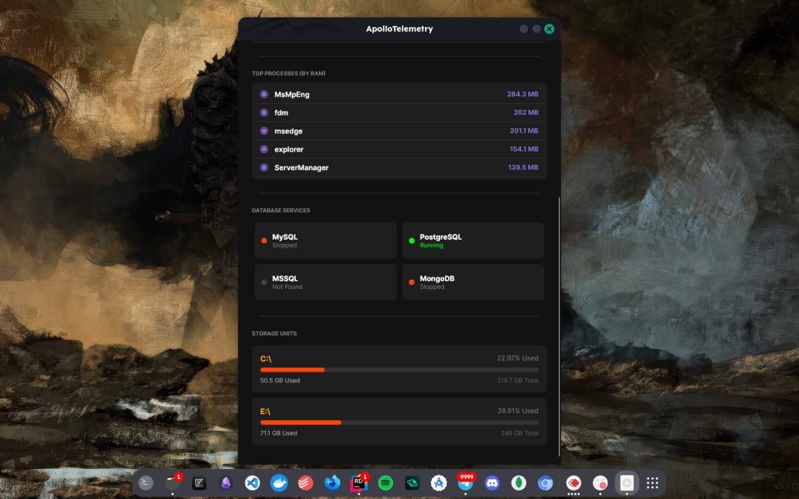

# ApolloTelemetry

## Project Overview

**ApolloTelemetry** is a local server monitoring tool built with **.NET**.  
It consists of a lightweight windows background **worker service** that tracks system vitals including **CPU**, **RAM**, and **Network throughput** and repeatdly echos them to a client application.

Any client running on the same **Local Area Network (LAN)** can connect to the agent and view the system telemetry in real time, enabling quick insight into the health and performance of the monitored machine.

---

### 📸 screenshots

<table>
  <tr>
    <td align="center">
      
    </td>
   
    
  </tr>
  <tr>
     <td align="center">
      
    </td>
   
    
  </tr>
</table>

---

## Features

- **Background Monitoring**  
  worker service designed for metrics collection.

- **Real-time Telemetry**  
  Live tracking of CPU usage, RAM usage, and Network throughput (Mbps).

- **Service Status Monitoring**  
  Tracks active database instances such as MySQL, MongoDB, and other services.

- **LAN Access**  
  all the monitored stats are accessible across a local network.

---

## Architecture

```
ApolloTelemetry
│
├── ApolloTelemetry.Agent       # Background worker service & Command API
├── ApolloTelemetry.Common      # Shared item definitions
└── ApolloTelemetry.Dashboard   # Desktop viewer (UI client)
```

---

## Running the Project

### 1. Start the Monitoring Agent

Run this on the server you want to monitor.

```bash
dotnet run src/ApolloTelemetry.Agent
```

---

### 2. Start the Viewer

Run this on your local machine.

```bash
dotnet run src/ApolloTelemetry.Dashboard
```

---

> **Note**
>
> Both machines must be on the **same local network**.  
> in the source code and change the DashboardUrl IP to the your's corresponding.
> The monitoring agent listens on **port 5002** by default.

---
